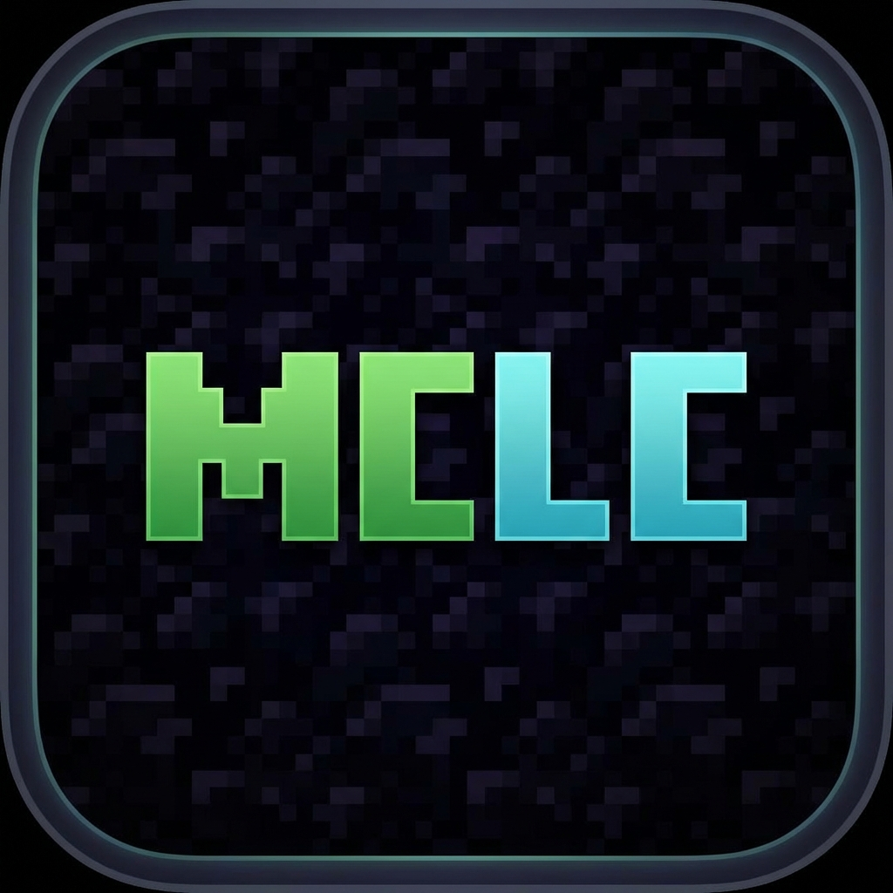

# MCLC - Modern Minecraft Launcher

<p align="center">
  
</p>

MCLC is a high-performance, modern, and beautiful Minecraft launcher built with **Electron**, **React**, and **Tailwind CSS**. It provides a premium experience for managing instances, skins, and modpacks with a focus on speed and aesthetics.

---

Virus Total Scan (v1.5.0): [https://www.virustotal.com/gui/file/61821e2a51fb7f79ebaddd400ad67f0ae3bbbcb93f93878c33f9a25f47815540?nocache=1](https://www.virustotal.com/gui/file/61821e2a51fb7f79ebaddd400ad67f0ae3bbbcb93f93878c33f9a25f47815540?nocache=1)
---

## Key Features

### Instance Management
- **Advanced Sorting & Grouping**: Organize your library by name, version, or playtime. Group instances by game version or loader for a cleaner look.
- **Modrinth Integration**: Seamlessly import modpacks and instances directly from Modrinth.
- **One-Click Launch**: Highly optimized launch process for Vanilla, Fabric, Forge, NeoForge, and Quilt.

### Skin & Cape Viewer
- **3D Previewing**: Real-time 3D rendering of your Minecraft skin and cape.
- **High-Quality Previews**: Sharp 2D head and body previews with depth shading.
- **Direct Integration**: Equip default skins (Steve/Alex) or custom textures directly within the launcher.
- **Slim Support**: Full support for slim (Alex) arm models.

### Reliability & Performance
- **Smart Connection Handling**: IPv4 priority and extended timeouts (30s) to fix common `ETIMEDOUT` errors with Mojang APIs.
- **Proactive Session Management**: High-frequency session verification with profile caching to prevent "429 Too Many Requests" errors.
- **Auto-Logout**: Secure session handling that automatically returns you to the login screen on authentication failure.

---

## Getting Started

### For Users
1. Download the latest `.exe` installer from the [Releases](https://github.com/Fernsehheft/MCLC-Client/releases) page.
2. Run the installer and follow the on-screen instructions.
3. Launch **MCLC** from your desktop or start menu.

### For Developers
#### Prerequisites
- [Node.js](https://nodejs.org/) (Latest LTS recommended)
- npm or yarn

#### Installation

1. **Clone the repository**
   ```bash
   git clone https://github.com/Fernsehheft/MCLC-Client.git
   cd MCLC-Client
   ```

2. **Install dependencies**
   ```bash
   npm install
   ```

3. **Run in development mode**
   ```bash
   npm run dev
   ```

4. **Build for production**
   ```bash
   npm run dist
   ```

---

## Tech Stack

- **Core**: [Electron](https://www.electronjs.org/)
- **Frontend**: [React](https://reactjs.org/) + [Vite](https://vitejs.dev/)
- **Styling**: [Tailwind CSS](https://tailwindcss.com/)
- **Minecraft Core**: [minecraft-launcher-core](https://github.com/Pierce01/Minecraft-Launcher-Core)
- **3D Rendering**: [skinview3d](https://github.com/bs-community/skinview3d)
- **State Management**: React Hooks & Context API

---

## Screenshots

*(Coming soon)*

---

## License & Credits

- Developed by **Fernsehheft, Mobilestars, ItzzMateo**
- Icons by [Heroicons](https://heroicons.com/)
- Powered by the amazing Minecraft open-source community.

---

<p align="center">Made with ❤️ for the Minecraft community</p>
